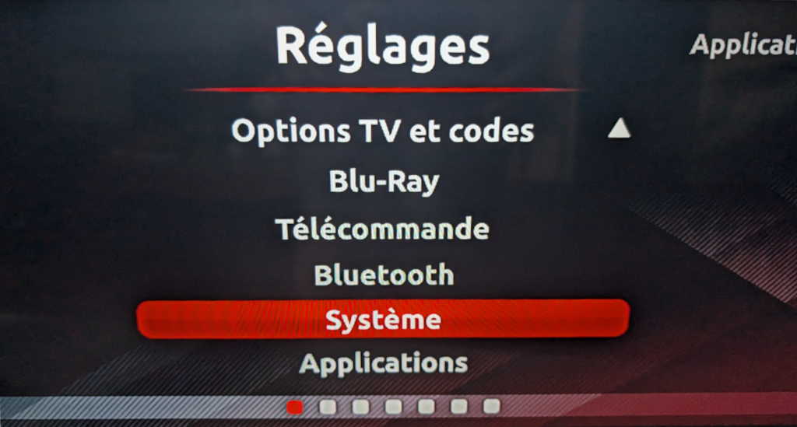
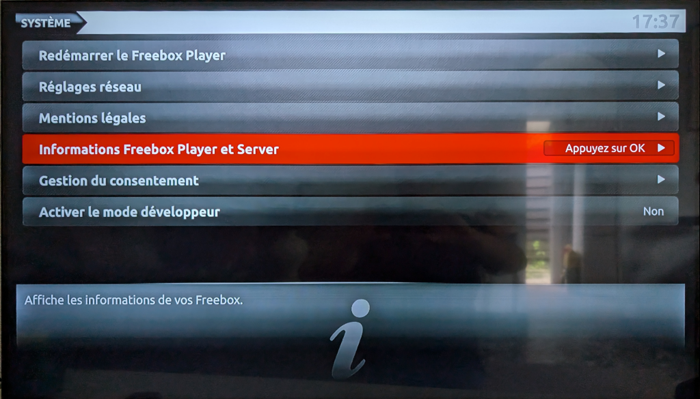

# Description
Télécommande pour téléphones et tablettes Android du Freebox Player v6 révolution (non-officielle, mise à jour d'une ancienne version)

Disponible sur le [Google Play](https://play.google.com/store/apps/details?id=com.obooklage.revolumote4)

L'auteur n'est pas affilié à la société [Free](https://www.free.fr/).

# Code de la télécommande

Vous trouverez le code dans le menu "Réglages -> Système -> Information Freebox Player et Server" du boitier TV.

Dans l'application, maintenir appuyé le bouton "OK" pour enter le code réseau de la télécommande.

